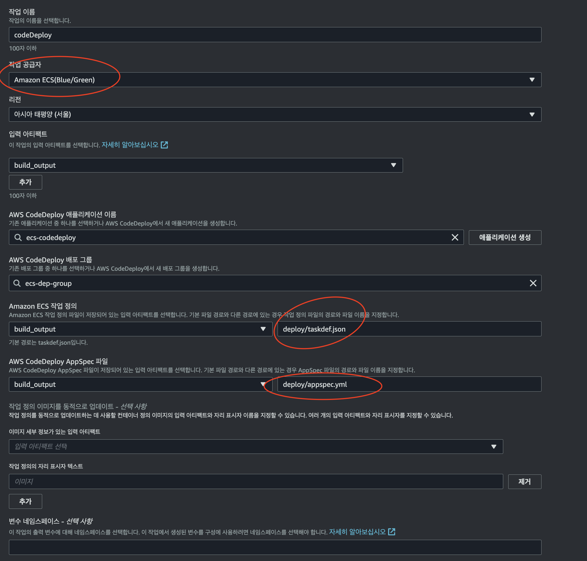

# CodePipeline Architecture


## Folder Architecture

```sh

    |- infra        ## infra use Terraform 
    |- server       ## server side application (express)
    |- deploy       ## deploy files (task-definition.json, appspec.yml)
```

## CodePipeline 구축 Terraform 

```sh
    ## 일부러 state는 설정안함 
    cd infra 
    terraform init && terraform apply
```

## 1. VPC 구축 및 ECS 설정

### VPC 

```sh
    ## Reference Terraform files
    infra/vpc.tf
```

- <a href="https://registry.terraform.io/modules/zkfmapf123/vpc3tier/lee/latest"> 모듈참조 </a>

### ECS Fargate 

```sh
    ## server 
    server/index.js

    ## Referenec Terraform files
    infra/ecs-alb.tf
    infra/ecs-iam.tf                ## ecs-execution-role, ecs-code-deploy-role
    infra/ecs-fargate.tf
    infra/ecs-code-deploy.tf
```

- ECR (Register)
- ECS Cluster
- ECS Service
- ECS Task Definition
- Application Load Balancer
- Target Group
- Lister Rule

- 참고사항

    - ECS Taks Definition의 경우 <a href="https://hub.docker.com/repository/docker/zkfmapf123/healthcheck/general"> zkfmapf123/healthcheck</a> Image를 사용합니다.
    - 이미지의 자세한 내용은 docker inspect 를 활용합니다
    - 처음 Provisioning 에만 사용됩니다.
    - 추후 배포는 CodePipeline + TaskDefinition 으로 구성합니다.
    - CodeDeploy를 사용하기 위해선 2가지 조건이 필요합니다. (Target Group : Blue/Green), (ECSService : BlueGreen Option)
    - 기존 ECS (Rolling) 배포옵션을 사용하고 있었다면, ECS Service를 재생성해야 합니다.
    - ECS CodeDeploy를 활용하기 위해선 2가지 파일이 필요합니다. (task-definition.json, appspec.yml)
    - CodeDeploy 배포옵션은 aws_codedeploy_deployment_group.*.deployment_config_name 옵션에서 수정합니다.

| 배포옵션                            | 설명                                                                                          |
|------------------------------------|------------------------------------------------------------------------------------------------|
| CodeDeployDefault.ECSAllAtOnce     | 모든 새 버전을 동시에 배포하고 이전 버전과 교체합니다.                                        |
| CodeDeployDefault.ECSCanary10Percent10Minutes | 새 버전을 Canary 배포로 배포하고, 각 배포 단계마다 최대 10%의 용량을 사용하여 교체합니다. |
| CodeDeployDefault.ECSCanary10Percent5Minutes  | Canary 배포로 새 버전을 배포하고, 각 배포 단계마다 최대 10%의 용량을 사용하여 교체합니다. |
| CodeDeployDefault.ECSCanary10Percent3Minutes  | Canary 배포로 새 버전을 배포하고, 각 배포 단계마다 최대 10%의 용량을 사용하여 교체합니다. |
| CodeDeployDefault.ECSTrafficShift   | 이전 버전과 새 버전 간의 트래픽을 제어하여 점진적으로 새 버전으로 전환합니다.                |

## 2. CodePipeline 구성

```sh

    ## Reference Terraform files
    infra/code-pipeline.tf
    infra/ecs-iam.tf
```




- 참고사항
    - GitHub Connect은 연결하여야 한다
    - CodePipelin.Build 테라폼 빡세다
    - deploy 폴더안에 task_definition.json, AppSpec.yml 을 위치해야 Build Artifacts를 통해서 CodeDeploy가 배포됨
    - <b>BuildArtifacts에 구성파일만 존재하면 CodeDeploy는 쉽게 진행됨</b>
    - CodeDeploy가 아닌 ECS (Blue/Green) 으로 구성해야 함 (in CodePipeline)

    ```yml
    ...
    post_build:
    commands:
      - cd ..
      - ls -lah ./deploy

    artifacts:
        files:
        - "deploy/*"
    ```


## 귀찮아서 안한거..

- Terraform은 Resource / Service 별로 폴더별로 관리해야 함
- Terraform Cloud를 붙힌다면 더더욱 좋을듯 함
- IAM Policy의 Resource는 개별로 지정하는 것이 좋음
- Task Definition, AppSpec 내의 Docker versioning은 추후에 진행해보자...
- Terrform이 다 구성되고, task_definition, AppSpec 을 자동으로 만들어주게끔 중간에 CLI를 만들어보는것도 좋을듯
- <b>CodeGuru Service가 Seoul Region에 들어오면 Security Scanning, Reviewer 구성해볼 예정</b>
- 운동해야되서 AWS Chatbot은 못붙힘 (쉬움)

## Reference

- <a href="https://repost.aws/questions/QU6quBySm3Tmqv1UixHTVRZw/listener-requirements-for-codedeploy-blue-green-deployments"> Blue/Green Target Group Issue </a>